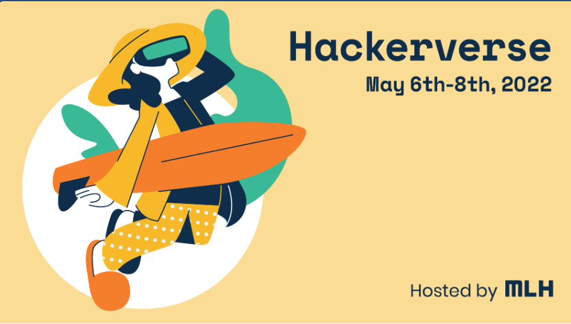

# Hackerverse 2022
### Official submission to Hackerverse 2022 by Team FluttAR

 

## Inspiration💡
While teaching my toddler cousin "A for apple, B for ball " my cousin was not intrested at all but just wanted to play on the phone as most of the toddlers these days. In addition to this he constantly asked me questions like, what is "U for umbrella" , "Y for yatch", etc. Hence, that's when it struck to me that it would be much intresting for the toddler and their age group if such things were taught visually. 

## What it does 🧭

Using our solution, we teach a toddler on alphabets and common objects associated with it with the help of AR. When the child clicks on a letter of the english alphabet then the object associated with the letter shows up as a model on the screen. This keeps the toddler interested in learning whilst he/she thinks that they have been playing around on the phone. 

## How we built it 🔧

Using EchoAR, HTML and CSS we built this platform. Using EchoAR we were able to visualize those models in AR at a open space. The front end side of things basically act as a medium for people to be able to access our application. 

## Tech Stack 🔨
1. Echo AR
2. HTML
3. CSS
4. Git
5. GitHub
6. AR.js

## Challenges we ran into 🏃‍♂️

1. Getting the models integrated with the letters of the english alphabet was a challenge for us given the time crunch.
2. Looking for resources that had VR models was a challenge  

## Accomplishments that we're proud of 🏅
1. Made the working prototype

## What we learned 🧠
1. The difference between MR, AR, VR and XR.
2. How VR and MR can influence future applications.
3. Echo AR and it's use

## What's next ⏭

1. Add in more letters of the English Alphabet

## Developers

1. [Eshaan Bhardwaj](https://github.com/Eshaan-B)
2. [Gyanesh Samanta](https://github.com/gyaneshsamanta)
3. [Aditya Kumar](https://github.com/ak8476)
4. [Yashodhana Shukla](https://github.com/Yashu6600)

